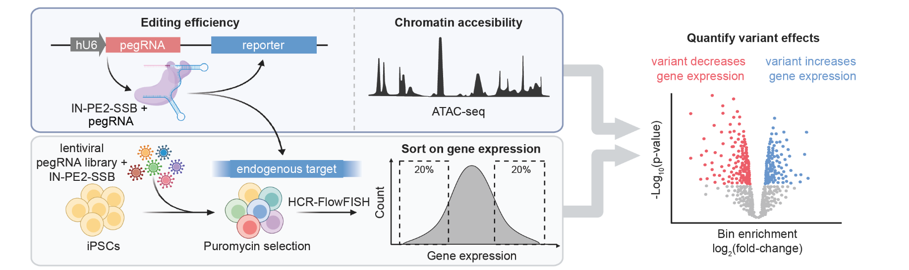
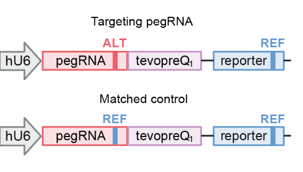
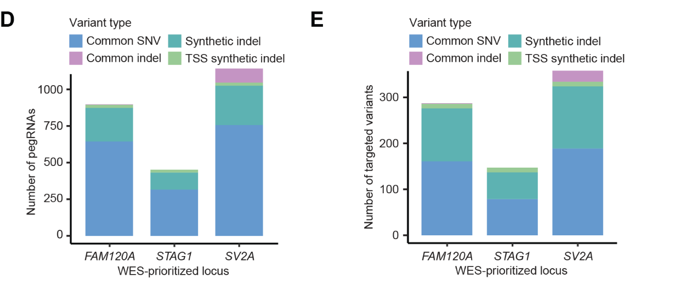
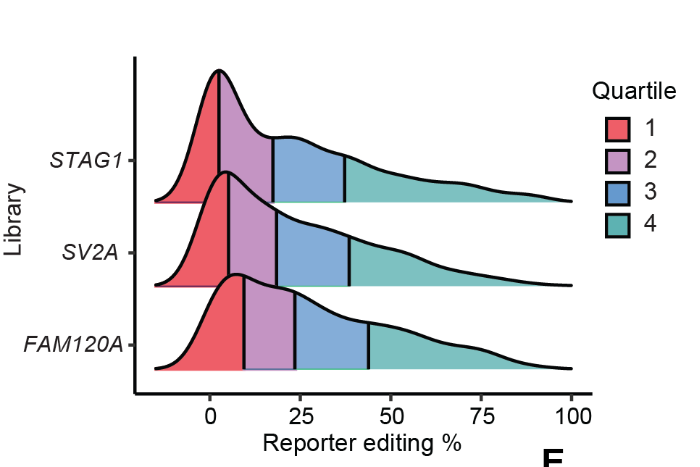
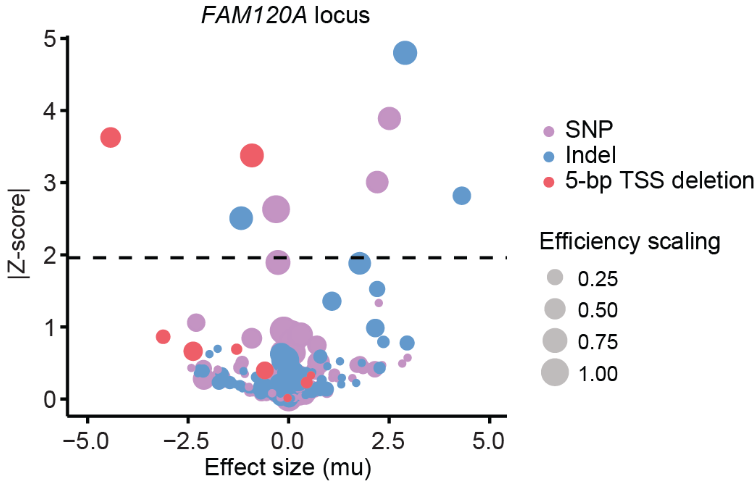
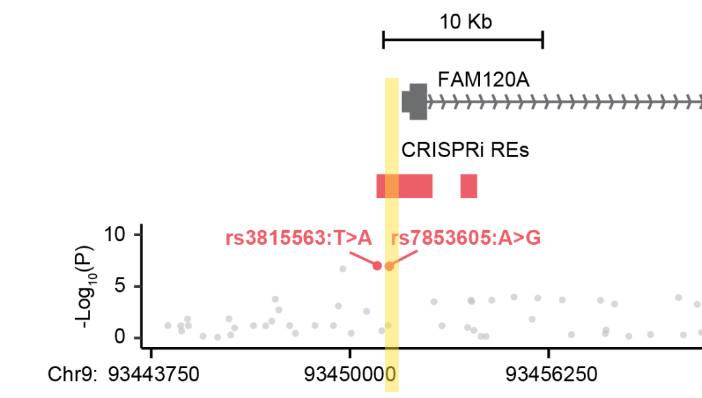
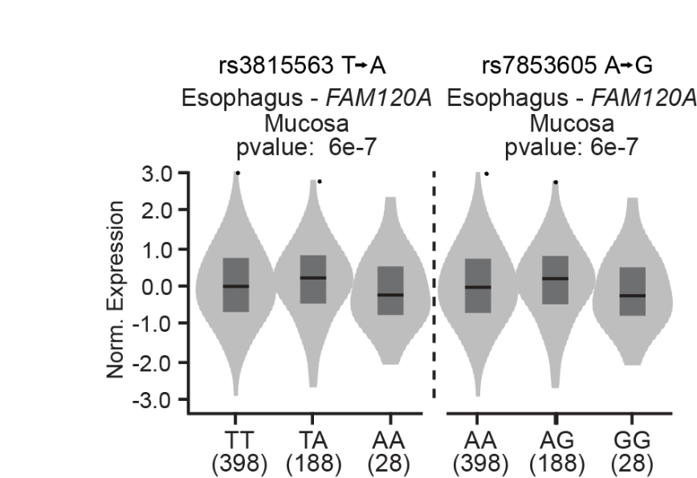

# Prime Editing pegRNA Screen Analysis

Analysis pipeline for pooled prime editing (PE) HCR-FlowFISH screens, from a pegRNA count table through activity-normalized variant effect size estimation with BEAN.

## Background

CRISPRi screens (see the companion [CRISPRi HCR-FlowFISH screen analysis](https://github.com/miahamilton5/CRISPRi_HCR-FlowFISH_screen_analysis) repo) identify which candidate regulatory elements near a gene affect its expression, but they don't resolve the effect down to an individual variant. To directly test individual common noncoding variants — SNPs and small indels — for their effect on gene expression, we use pooled prime editing (PE) screens: pegRNAs installing the reference (REF) or alternate (ALT) allele at a variant of interest are introduced into cells via a pooled lentiviral library, so that each cell receives at most one pegRNA and installs at most one variant. Cells are then stained by HCR-FlowFISH for the target gene transcript (normalized to the housekeeping gene TBP to control for cell size/permeability) and sorted by FACS into bins based on target gene expression — bottom 20% and top 20% in these screens — along with a bulk (unsorted) sample. Sequencing and counting pegRNAs in each bin then measures how enriched or depleted each variant-installing pegRNA is between the low- and high-expression bins: a pegRNA (and therefore the variant it installs) enriched in the low-expression bin indicates that installing that variant decreases target gene expression, and vice versa.

Because prime editing efficiency varies substantially from pegRNA to pegRNA and from site to site, each pegRNA is paired with a self-reporter: a synthetic copy of its own target sequence cloned downstream of the pegRNA in the same lentiviral construct, which the pegRNA also edits. Sequencing this reporter alongside the pegRNA identity gives a readout of editing efficiency that can act as a proxy for endogenous editing, without needing to sequence the endogenous locus in every cell — which isn't practical here, since the variants in a screen are spread across a ~1 Mb region, so there's no single PCR that could capture endogenous editing frequencies at every site the way one PCR of the pooled reporter/pegRNA construct can.



Every targeting pegRNA (installing the ALT allele) is paired with a matched-control pegRNA that installs the REF allele at the same site through the same construct. This controls for steric effects of pegRNA binding and unintended edits at the endogenous site that have nothing to do with which allele gets installed:



This study ran three PE screens, one per WES-prioritized locus (FAM120A, SV2A, STAG1), each with its own independently-designed pegRNA library: common SNPs prioritized from GWAS/FINEMAP fine-mapping and CRISPRi hits (up to 4 pegRNAs per SNP), small synthetic indels centered on those SNPs to increase detectable effect size (up to 2 pegRNAs per indel), and 5 bp synthetic deletions at the target gene's TSS as positive controls, each targeting pegRNA paired with a matched REF-allele control, plus 100-200 non-targeting control pegRNAs per library. pegRNAs were designed with [PRIDICT2.0](https://github.com/uzh-dqbm-cmi/PRIDICT), favoring higher predicted editing efficiency:



gBlocks encoding each pegRNA, its RT template and PBS, and its reporter were cloned into `pLenti-AN-U6-IN-PE2-SSB-puroR`, transduced into i3N-WTC11 iPSCs (with VPA and hMLH1dn co-treatment to boost editing efficiency), and screened by HCR-FlowFISH three weeks post-transduction, sorting into bottom-20%/top-20%-expression bins (normalized to TBP) across 4 replicates, plus a bulk unsorted sample per replicate. The STAG1 library showed the lowest reporter editing efficiency of the three, so cells were additionally sorted into 20-40%/60-80% bins for that screen to increase sensitivity.

| Bin | Sample naming (this repo's convention) |
|---|---|
| Bottom 20% expression | `peg<LOCUS>_b20_r{1-4}` |
| Top 20% expression | `peg<LOCUS>_t20_r{1-4}` |
| Bulk (unsorted) | `peg<LOCUS>_bulk_r{1-4}` |

This repository walks through the pipeline scripts using the real FAM120A locus screen as a worked example (1,710 pegRNAs installing 1,143 unique variants); the same scripts apply unchanged to the SV2A and STAG1 screens, whose libraries aren't included in this repo.

## Tools and versions used

- [BEAN](https://github.com/pinellolab/crispr-bean) (`crispr-bean`) — Ryu et al. 2024, *Nat Genet*, "Joint genotypic and phenotypic outcome modeling improves base editing variant effect quantification"
- [PRIDICT2.0](https://github.com/uzh-dqbm-cmi/PRIDICT) — pegRNA design and predicted editing efficiency scoring
- R with dplyr, data.table, ggplot2, ggridges
- Python 3 with matplotlib

## Repository contents

- `pegRNA_library/FAM120A_pegRNA_library.csv` — the real FAM120A pegRNA library reference (name, target variant, class, locus, spacer sequence) used as a worked example throughout this README.
- `scripts/01_generate_count_table.R` through `scripts/04_analyze_bean_results.R` — the full count-table/scaling/BEAN/results pipeline, walked through below. The underlying per-read mapping files, count tables, and BEAN output are not included in this repo; only the library reference is.
- `scripts/plot_library_composition.py` — plots pegRNA/target counts per library class directly from a pegRNA library CSV.
- `scripts/plot_reporter_editing_density.R` — plots the distribution of per-pegRNA reporter editing rates.

## Pipeline walkthrough: FAM120A

### 1. Generate a raw count table and reporter editing rates

```
Rscript 01_generate_count_table.R pegFAM120A 4 <mapped_reads_dir> <reporter_editing_dir> <pegRNA_library.csv> <output_dir>
```

Reads are assigned to a single best-matching pegRNA `oligo_id` by perfect-match alignment to the library reference (pegRNA spacer + reporter + barcode). For each replicate, per-oligo read counts in the b20/t20/bulk bins are joined and filtered on `bulk >= 10` reads, the same library-dropout filter used in the CRISPRi pipeline: a pegRNA missing from the bulk sample dropped out of the library for a reason unrelated to sorting (poor cloning/PCR representation, a growth defect), and shouldn't be mistaken for a genuine sorting-driven effect. Reporter editing rate per oligo (`percent_editing`, from sequencing the self-reporter) is averaged across bulk replicates; non-targeting control pegRNAs install no edit, so their reporter is always the reference sequence and they're treated as 100% "editing."

### 2. Predict endogenous editing and scale counts for BEAN

```
Rscript 02_scale_counts_for_bean.R <counts.csv> <average_editing.csv> <atac_signal.csv> <pegRNA_library.csv> <output_dir>
```

Reporter-measured editing is a proxy for the actual endogenous editing rate, and that proxy is systematically biased by chromatin accessibility at the target site (open chromatin edits more efficiently at the endogenous locus than the equally-accessible episomal reporter would predict). We correct for this with a chromatin-accessibility-adjusted prediction:

```r
predicted_endo_editing <- average_percent_editing * ((log10(avg_score_5bp_rollavg) * 1.5) - 0.34)
predicted_endo_editing <- pmin(pmax(predicted_endo_editing, 0), 100)
```

This predicted rate becomes each pegRNA's scaling factor for BEAN (`predicted_endo_editing / 100`), floored at 0.1 for any pegRNA with very low predicted editing so it isn't scaled to near-zero weight, and set to 1 for matched-control and non-targeting pegRNAs. Separately, each bin/replicate's raw count is multiplied by the reporter editing fraction (`average_percent_editing / 100`) to produce an "edited pseudo-count" table, so BEAN's input read counts approximate the number of edited molecules actually observed in each bin.

### 3. Run BEAN

```
./03_run_bean.sh <pegRNA_library.csv> <sample_info.csv> <counts.csv> <edited_counts.csv> <bcmatch_counts.csv> <output_dir>
```

This wraps `bean create-screen` (to build a `ReporterScreen` object from the raw, edited-pseudo-count, and barcode-matched count matrices plus library/sample info), `bean qc`, and `bean run sorting variant` (BEAN's variant-library mode, appropriate here since several pegRNAs tile each targeted variant and only the intended edit — not bystander edits — is of interest). The accessibility-adjusted editing-rate scaling from Step 2 is incorporated into the guide metadata before the final run via a manual correction step after `bean qc` (not included in this repo); `bean run` itself was called with no extra options beyond `-o`. Reporter editing rates across the three PE screens in this study had a median of 17-23%:



BEAN's main output is an element-level result table, `bean_element_result.MixtureNormal.csv`, with one posterior effect size (`mu`) and standard deviation (`mu_sd`) per pegRNA-defined target — including both targeting pegRNAs and their matched controls.

### 4. Compute allelic effect sizes and call hits

```
Rscript 04_analyze_bean_results.R <bean_element_result.MixtureNormal.csv> <grouped_matched_key.csv> <output_table.csv>
```

BEAN's raw `mu` for a targeting pegRNA still includes any construct/steric effect shared with its matched control, so the allele-specific effect of each variant is the *difference* between the two, with the two posterior standard deviations propagated into a z-score:

```r
allelic_mu      = mu_targeting - mu_matched
allelic_z_score = (mu_targeting - mu_matched) / sqrt(mu_sd_targeting^2 + mu_sd_matched^2)
```

Variants are called significant at `|allelic_z_score| >= 1.98`. Running this on the real FAM120A BEAN output: 264 variants had a matched control pair available for this comparison, and 8 were called significant (2 5-bp TSS deletions, 2 5-bp synthetic deletions, 3 SNPs, and 1 other variant) — matching the published result for this screen (dot size below is each variant's editing/scaling efficiency from Step 2; the strongest hit is a 5 bp TSS deletion, as expected since direct disruption of the TSS should have the largest effect on expression of any variant class):



## What the results show

One of these hits, the FINEMAP SNP rs7853605:A>G, sits directly in the FAM120A promoter (highlighted below) and significantly increased FAM120A expression in this screen:



This is consistent with the direction of its effect as a GTEx eQTL for FAM120A in esophagus - mucosa (p = 6e-7):



Another hit, rs117810130:C>T, was validated in individual edited clones by RT-qPCR, trending toward decreased FAM120A expression in line with the pooled screen.
