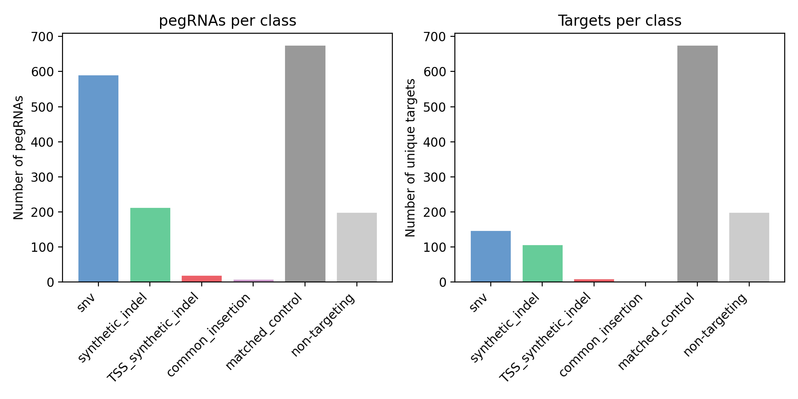
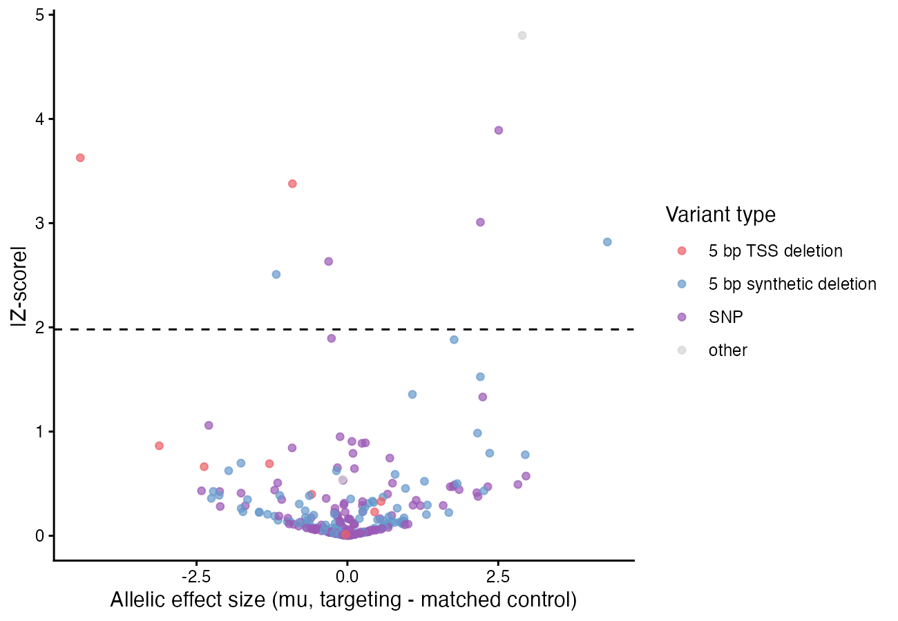
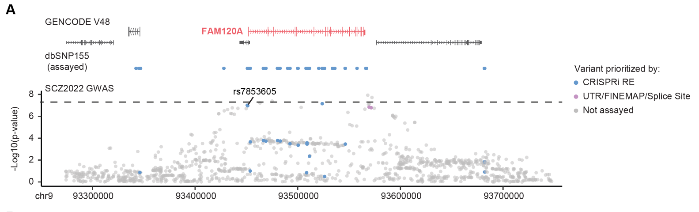

# Prime Editing pegRNA Screen Analysis

Analysis pipeline for pooled prime editing (PE) HCR-FlowFISH screens, from a pegRNA count table through activity-normalized variant effect size estimation with BEAN.

## Background

CRISPRi screens (see the companion [CRISPRi HCR-FlowFISH screen analysis](https://github.com/miahamilton5/CRISPRi_HCR-FlowFISH_screen_analysis) repo) identify which candidate regulatory elements near a gene affect its expression, but they don't resolve the effect down to an individual variant. To directly test individual common noncoding variants — SNPs and small indels — for their effect on gene expression, we use pooled prime editing (PE) screens: pegRNAs installing the reference (REF) or alternate (ALT) allele at a variant of interest are introduced into cells via a pooled lentiviral library, so that each cell receives at most one pegRNA and installs at most one variant. Cells are then stained by HCR-FlowFISH for the target gene transcript (normalized to the housekeeping gene TBP to control for cell size/permeability) and sorted by FACS into bins based on target gene expression — bottom 20% and top 20% in these screens — along with a bulk (unsorted) sample. Sequencing and counting pegRNAs in each bin then measures how enriched or depleted each variant-installing pegRNA is between the low- and high-expression bins: a pegRNA (and therefore the variant it installs) enriched in the low-expression bin indicates that installing that variant decreases target gene expression, and vice versa.

Because prime editing efficiency varies substantially from pegRNA to pegRNA and from site to site, each pegRNA is paired with a self-reporter: a synthetic copy of its own target sequence cloned downstream of the pegRNA in the same lentiviral construct, which the pegRNA also edits. Sequencing this reporter alongside the pegRNA identity gives a per-cell, per-pegRNA readout of editing efficiency that can be used to weight each pegRNA's contribution to the effect-size estimate, without needing to sequence the (much less accessible) endogenous locus in every cell.


Every targeting pegRNA (installing the ALT allele) is paired with a matched-control pegRNA that installs the REF allele at the same site through the same construct. This controls for any effect of the prime-editing machinery or lentiviral construct itself — steric effects of pegRNA binding, reporter expression, etc. — that has nothing to do with which allele gets installed:


This repository walks through the pipeline using the FAM120A locus screen as a worked example: 1,710 pegRNAs installing 1,143 unique variants (common SNPs prioritized from GWAS/FINEMAP fine-mapping and CRISPRi hits, small synthetic indels centered on those SNPs to increase detectable effect size, and 5 bp synthetic deletions at the FAM120A TSS as positive controls), each targeting pegRNA paired with a matched REF-allele control, plus 200 non-targeting control pegRNAs.

| Class | pegRNAs | Unique targets |
|---|---|---|
| `snv` (common SNP) | 592 | 148 |
| `synthetic_indel` (5 bp deletion centered on a SNP) | 214 | 107 |
| `common_insertion` | 8 | 2 |
| `TSS_synthetic_indel` (5 bp TSS deletion, positive control) | 20 | 10 |
| `matched_control` (REF-allele paired control) | 676 | 676 |
| `non-targeting` | 200 | 200 |

pegRNAs were designed with [PRIDICT2.0](https://github.com/uzh-dqbm-cmi/PRIDICT), and up to 4 pegRNAs were kept per common SNP and up to 2 per synthetic indel, favoring higher predicted editing efficiency. gBlocks encoding each pegRNA, its RT template and PBS, and its reporter were cloned into `pLenti-AN-U6-IN-PE2-SSB-puroR`, transduced into i3N-WTC11 iPSCs (with VPA and hMLH1dn co-treatment to boost editing efficiency), and screened by HCR-FlowFISH three weeks post-transduction, sorting into bottom-20%/top-20%-expression bins (normalized to TBP) across 4 replicates, plus a bulk unsorted sample per replicate:

| Bin | Sample naming (this repo's convention) |
|---|---|
| Bottom 20% expression | `pegFAM120A_b20_r{1-4}` |
| Top 20% expression | `pegFAM120A_t20_r{1-4}` |
| Bulk (unsorted) | `pegFAM120A_bulk_r{1-4}` |

## Tools and versions used

- [BEAN](https://github.com/pinellolab/crispr-bean) (`crispr-bean`) — Ryu et al. 2024, *Nat Genet*, "Joint genotypic and phenotypic outcome modeling improves base editing variant effect quantification"
- [PRIDICT2.0](https://github.com/uzh-dqbm-cmi/PRIDICT) — pegRNA design and predicted editing efficiency scoring
- R with dplyr, data.table, ggplot2, ggridges
- Python 3 with matplotlib

## Repository contents

- `pegRNA_library/FAM120A_pegRNA_library.csv` — the real FAM120A pegRNA library reference (name, target variant, class, locus, spacer sequence) used as a worked example throughout this README.
- `scripts/01_generate_count_table.R` through `scripts/04_analyze_bean_results.R` — the full count-table/scaling/BEAN/results pipeline, walked through below. The underlying per-read mapping files, count tables, and BEAN output are not included in this repo; only the library reference and rendered example plots (generated from the real FAM120A screen data) are.
- `scripts/plot_library_composition.py` — plots pegRNA/target counts per library class directly from a pegRNA library CSV.
- `scripts/plot_reporter_editing_density.R` — plots the distribution of per-pegRNA reporter editing rates.

## Pipeline walkthrough: FAM120A

### 1. Generate a raw count table and reporter editing rates

```
Rscript 01_generate_count_table.R pegFAM120A 4 <mapped_reads_dir> <reporter_editing_dir> <pegRNA_library.csv> <output_dir>
```

Reads are assigned to a single best-matching pegRNA `oligo_id` by perfect-match alignment to the library reference (pegRNA spacer + reporter + barcode). For each replicate, per-oligo read counts in the b20/t20/bulk bins are joined and filtered on `bulk >= 10` reads, the same library-dropout filter used in the CRISPRi pipeline: a pegRNA missing from the bulk sample dropped out of the library for a reason unrelated to sorting (poor cloning/PCR representation, a growth defect), and shouldn't be mistaken for a genuine sorting-driven effect. Reporter editing rate per oligo (`percent_editing`, from sequencing the self-reporter) is averaged across bulk replicates; non-targeting control pegRNAs install no edit, so their reporter is always the reference sequence and they're treated as 100% "editing."

Because several targeting pegRNAs can share the same matched-control pegRNA, that control's counts and editing rate are duplicated once per targeting pegRNA that references it, so BEAN's downstream model doesn't treat the same matched-control reads as non-independent replicates of each other across multiple variants.

The plot below counts pegRNAs and unique targets per library class directly from the real FAM120A library CSV in this repo:



### 2. Predict endogenous editing and scale counts for BEAN

```
Rscript 02_scale_counts_for_bean.R <counts.csv> <average_editing.csv> <atac_signal.csv> <pegRNA_library.csv> <output_dir>
```

Reporter-measured editing is a proxy for the actual endogenous editing rate, and that proxy is systematically biased by chromatin accessibility at the target site (open chromatin edits more efficiently at the endogenous locus than the equally-accessible episomal reporter would predict). We correct for this with a chromatin-accessibility-adjusted prediction:

```r
predicted_endo_editing <- average_percent_editing * ((log10(avg_score_5bp_rollavg) * 1.5) - 0.34)
predicted_endo_editing <- pmin(pmax(predicted_endo_editing, 0), 100)
```

This predicted rate becomes each pegRNA's scaling factor for BEAN (`predicted_endo_editing / 100`), floored at 0.1 for any pegRNA with very low predicted editing so it isn't scaled to near-zero weight, and set to 1 for matched-control and non-targeting pegRNAs. Separately, each bin/replicate's raw count is multiplied by the reporter editing fraction (`average_percent_editing / 100`) to produce an "edited pseudo-count" table, so BEAN's input read counts approximate the number of edited molecules actually observed in each bin.

### 3. Run BEAN

```
./03_run_bean.sh <pegRNA_library_with_scaling.csv> <sample_info.csv> <edited_counts.csv> <output_dir>
```

This wraps `bean create-screen` (to build a `ReporterScreen` object from the count matrix and library/sample info) and `bean run sorting variant --scale-by-acc` (BEAN's variant-library mode, appropriate here since several pegRNAs tile each targeted variant and only the intended edit — not bystander edits — is of interest). BEAN was run with default parameters otherwise, grouping pegRNAs by the variant/edit they install and scaling each by the accessibility-adjusted editing rate from Step 2; matched-control pegRNAs are scaled identically to their corresponding targeting pegRNA. Reporter editing rates across the three PE screens in this study had a median of 17-23%:


BEAN's main output is an element-level result table, `bean_element_result.MixtureNormal.csv`, with one posterior effect size (`mu`) and standard deviation (`mu_sd`) per pegRNA-defined target — including both targeting pegRNAs and their matched controls.

### 4. Compute allelic effect sizes and call hits

```
Rscript 04_analyze_bean_results.R <bean_element_result.MixtureNormal.csv> <grouped_matched_key.csv> <output_table.csv>
```

BEAN's raw `mu` for a targeting pegRNA still includes any construct/steric effect shared with its matched control, so the allele-specific effect of each variant is the *difference* between the two, with the two posterior standard deviations propagated into a z-score:

```r
allelic_mu      = mu_targeting - mu_matched
allelic_z_score = (mu_targeting - mu_matched) / sqrt(mu_sd_targeting^2 + mu_sd_matched^2)
```

Variants are called significant at `|allelic_z_score| >= 1.98`. Running this on the real FAM120A BEAN output: 264 variants had a matched control pair available for this comparison, and 8 were called significant (2 5-bp TSS deletions, 2 5-bp synthetic deletions, 3 SNPs, and 1 other variant):



## What the results show

The shape of this real allelic-effect-size plot matches the published result for this screen: the strongest hit is a 5 bp TSS deletion (as expected — direct disruption of the TSS should have the largest effect on expression of any variant class), and several common SNPs and synthetic deletions clear the significance threshold on both sides (increasing and decreasing FAM120A expression).


One of these hits, the FINEMAP SNP rs7853605:A>G in the FAM120A promoter, significantly increased FAM120A expression in this screen, consistent with the direction of its effect as a GTEx eQTL in esophagus - mucosa. Another hit, rs117810130:C>T, was validated in individual edited clones by RT-qPCR, trending toward decreased FAM120A expression in line with the pooled screen. The locus view below shows every variant assayed in this screen relative to the FAM120A gene body and the underlying SCZ GWAS signal:


